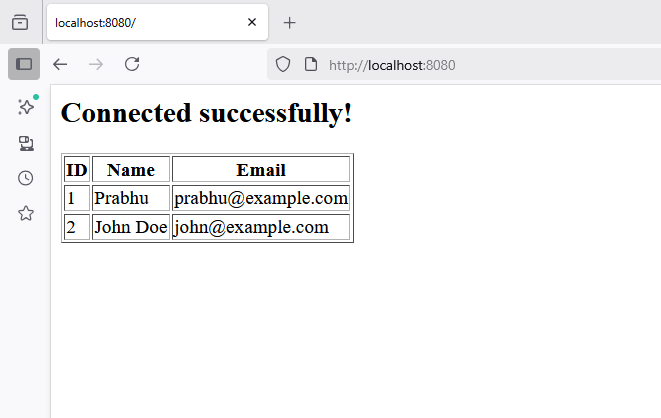

# Docker for Beginners: Setting up Apache with PHP, MySQL, and PHPMyAdmin 
```
https://www.youtube.com/watch?v=_UEZX-dA-O4 
```

Let’s create a **simple Dockerized PHP + MySQL project** — a working example with a PHP page connecting to MySQL.

---

## 🧱 Folder Structure

```
php-mysql-docker/
│
├── docker-compose.yml
├── php/
│   └── index.php
└── db/
    └── init.sql
```

---

## ⚙️ Step 1: Create `docker-compose.yml`

```yaml
version: '3.8'

services:
  php:
    image: php:8.2-apache
    container_name: php_app
    volumes:
      - ./php:/var/www/html
    ports:
      - "8080:80"
    depends_on:
      - db

  db:
    image: mysql:8.0
    container_name: mysql_db
    restart: always
    environment:
      MYSQL_ROOT_PASSWORD: root
      MYSQL_DATABASE: testdb
      MYSQL_USER: testuser
      MYSQL_PASSWORD: testpass
    volumes:
      - db_data:/var/lib/mysql
      - ./db/init.sql:/docker-entrypoint-initdb.d/init.sql

volumes:
  db_data:
```
This defines:

* `php` → Apache + PHP container serving files from `php/`
* `db` → MySQL database with an initial SQL script

---

# OR
`Dockerfile`
```yml
FROM php:apache
RUN docker-php-ext-install mysqli
```

`docker-compose.yml`
```yml
services:
  web:
    # image: php:8.2-apache
    build: .
    container_name: php_app
    volumes:
      - ./php:/var/www/html
    ports:
      - "8080:80"
    depends_on:
      - db

  db:
    image: mysql:8.0
    container_name: mysql_db
    restart: always
    environment:
      MYSQL_ROOT_PASSWORD: root
      MYSQL_DATABASE: testdb
      MYSQL_USER: testuser
      MYSQL_PASSWORD: testpass
    volumes:
      - db_data:/var/lib/mysql
      - ./db/init.sql:/docker-entrypoint-initdb.d/init.sql

volumes:
  db_data:
```

## 🗄️ Step 2: Create `db/init.sql`

```sql
CREATE TABLE IF NOT EXISTS users (
  id INT AUTO_INCREMENT PRIMARY KEY,
  name VARCHAR(100),
  email VARCHAR(100)
);

INSERT INTO users (name, email) VALUES
('Prabhu', 'prabhu@example.com'),
('John Doe', 'john@example.com');
```

---

## 🧾 Step 3: Create `php/index.php`

```php
<?php
$servername = "db";
$username = "testuser";
$password = "testpass";
$dbname = "testdb";

$conn = new mysqli($servername, $username, $password, $dbname);

if ($conn->connect_error) {
  die("Connection failed: " . $conn->connect_error);
}

echo "<h2>Connected successfully!</h2>";

$result = $conn->query("SELECT * FROM users");

if ($result->num_rows > 0) {
  echo "<table border='1'><tr><th>ID</th><th>Name</th><th>Email</th></tr>";
  while($row = $result->fetch_assoc()) {
    echo "<tr><td>{$row['id']}</td><td>{$row['name']}</td><td>{$row['email']}</td></tr>";
  }
  echo "</table>";
} else {
  echo "No users found.";
}

$conn->close();
?>
```

---

## 🚀 Step 4: Run the Project

```bash
docker-compose up -d
```

* Wait a few seconds for MySQL to initialize.
* Then open your browser to:
  👉 **[http://localhost:8080](http://localhost:8080)**

You’ll see:

> Connected successfully!
> (A table of users)

```bash
docker compose up -d
```

```bash
docker compose ps
```

```bash
docker compose exec db bash
```

```
mysql -u root -p root
```

```
SHOW DATABASES;
```
---

## 🧹 Stop Containers

```bash
docker-compose down
```

To delete the database volume too:

```bash
docker-compose down -v
```

---

Would you like me to add **phpMyAdmin** to the setup so you can view the database visually in a browser ([http://localhost:8081](http://localhost:8081))?


