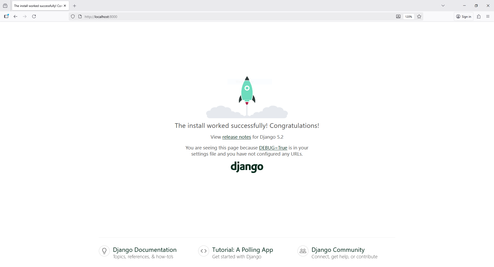

Here’s a clean, production-ready setup to **Dockerize a Django app using SQLite** (no MySQL/Postgres dependency).

```
pip install django
```

```
django-admin startproject config .
```

```
python manage.py startapp backend
```

```
pip freeze > requirements.txt
```

```
python manage.py migrate
```


---

## 🧱 Project Structure

```
django_app/
│
├── Dockerfile
├── docker-compose.yml
├── requirements.txt
├── manage.py
├── myproject/
│   ├── __init__.py
│   ├── settings.py
│   ├── urls.py
│   └── wsgi.py
└── app/
    ├── __init__.py
    ├── models.py
    ├── views.py
    ├── ...
```

---

## 🐳 Step 1: Create `Dockerfile`

```dockerfile
# Use official Python image
FROM python:3.12-slim

# Set working directory
WORKDIR /usr/src/app

# Prevent Python from writing pyc files
ENV PYTHONDONTWRITEBYTECODE 1
ENV PYTHONUNBUFFERED 1

# Install system dependencies
RUN apt-get update && apt-get install -y \
    libpq-dev gcc && \
    apt-get clean

# Copy requirements first (for better cache)
COPY requirements.txt .

# Install Python dependencies
RUN pip install --no-cache-dir -r requirements.txt

# Copy project files
COPY . .

# Expose Django development port
EXPOSE 8000

# Run Django development server
CMD ["python", "manage.py", "runserver", "0.0.0.0:8000"]
```

---

## 📦 Step 2: `requirements.txt`

Example:

```
Django==5.1.1
gunicorn==23.0.0
```

---

## ⚙️ Step 3: `docker-compose.yml`

SQLite doesn’t need a separate container — it’s just a local file.
We’ll map the SQLite database and app code for persistence.

```yaml
version: '3.9'

services:
  web:
    build: .
    container_name: django_app
    command: python manage.py runserver 0.0.0.0:8000
    ports:
      - "8000:8000"
    volumes:
      - .:/usr/src/app
      - ./db.sqlite3:/usr/src/app/db.sqlite3
    environment:
      - DEBUG=1
```

---

## ⚙️ Step 4: Update `settings.py` for SQLite

Make sure your database settings look like this:

```python
DATABASES = {
    'default': {
        'ENGINE': 'django.db.backends.sqlite3',
        'NAME': BASE_DIR / 'db.sqlite3',
    }
}
```

---

## 🚀 Step 5: Build and Run

```bash
docker-compose build
docker-compose up -d
```

---

## 🧰 Step 6: Run Migrations and Create Superuser

Open another terminal:

```bash
docker-compose exec web python manage.py migrate
docker-compose exec web python manage.py createsuperuser
```

---

## ✅ Optional (Production-ready with Gunicorn)

For production, change your `Dockerfile` `CMD` to:

```dockerfile
CMD ["gunicorn", "--bind", "0.0.0.0:8000", "myproject.wsgi:application"]
```

# OR

Excellent — that error is common when Docker runs your Django + SQLite setup.
Let’s fix it ✅

---

## 🧩 Problem Explanation

`django.db.utils.OperationalError: unable to open database file` usually means:

1. **The SQLite file or its directory isn’t writable inside the container.**
2. **The volume mapping for `db.sqlite3` is wrong or missing.**
3. **SQLite can’t create the file because the folder doesn’t exist.**

---

## 🛠 Step-by-Step Fix


### **If you want to keep a persistent db.sqlite3 file outside**

Make sure the file exists and has correct permissions **before running Docker**:

```bash
touch db.sqlite3
chmod 666 db.sqlite3
```

Then keep this mapping:

```yaml
volumes:
  - .:/usr/src/app
  - ./db.sqlite3:/usr/src/app/db.sqlite3
```

Now restart:

```bash
docker-compose down -v
docker-compose up --build
```



---

Would you like me to include **Nginx** in this setup for production deployment (to serve static files and proxy Gunicorn)?
