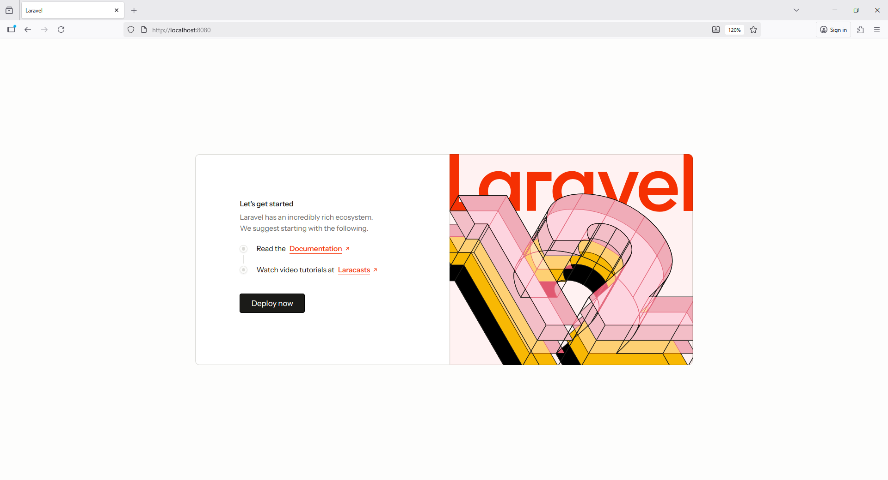

Let’s **Dockerize your Laravel application** properly — step by step — including **PHP, MySQL, Nginx**, and **Composer** setup.

---

## 🧩 Folder structure

Your project should look like this:

```
laravel-app/
├── app/
├── bootstrap/
├── config/
├── database/
├── public/
├── routes/
├── vendor/
├── composer.json
├── Dockerfile
├── docker-compose.yml
└── .env
```

---

## ⚙️ Step 1: `Dockerfile`

Create a file named **`Dockerfile`** in the project root:

```Dockerfile
# Use the official PHP image
FROM php:8.2-fpm

# Install system dependencies
RUN apt-get update && apt-get install -y \
    git \
    curl \
    zip \
    unzip \
    libpng-dev \
    libjpeg-dev \
    libfreetype6-dev \
    libonig-dev \
    libxml2-dev \
    libzip-dev \
    && docker-php-ext-configure gd --with-freetype --with-jpeg \
    && docker-php-ext-install pdo pdo_mysql mbstring exif pcntl bcmath gd zip
    
# Enable mod_rewrite
# RUN a2enmod rewrite

# Install PHP extensions
# RUN docker-php-ext-install pdo_mysql zip

# ENV APACHE_DOCUMENT_ROOT=/var/www/html/public
# RUN sed -ri -e 's!/var/www/html!${APACHE_DOCUMENT_ROOT}!g' /etc/apache2/sites-available/*.conf
# RUN sed -ri -e 's!/var/www/!${APACHE_DOCUMENT_ROOT}!g' /etc/apache2/apache2.conf /etc/apache2/conf-available/*.conf

# Install Composer
COPY --from=composer:2 /usr/bin/composer /usr/bin/composer

# Install composer
# RUN curl -sS https://getcomposer.org/installer | php -- --install-dir=/usr/local/bin --filename=composer

# Install project dependencies
# RUN composer install

# Set permissions
# RUN chown -R www-data:www-data /var/www/html/storage /var/www/html/bootstrap/cache

# Set working directory
WORKDIR /var/www

# Copy everything into the container
COPY . .

# Install dependencies
RUN composer install

# Expose port 9000 and start php-fpm
EXPOSE 9000
CMD ["php-fpm"]
```

---

## 🐳 Step 2: `docker-compose.yml`

Create **`docker-compose.yml`** in your project root:

```yaml
version: "3.8"

services:
  app:
    build:
      context: .
      dockerfile: Dockerfile
    container_name: laravel_app
    restart: unless-stopped
    working_dir: /var/www
    volumes:
      - .:/var/www
      - ./vendor:/var/www/vendor
    networks:
      - laravel

  web:
    image: nginx:alpine
    container_name: laravel_web
    restart: unless-stopped
    ports:
      - "8080:80"
    volumes:
      - .:/var/www
      - ./nginx/default.conf:/etc/nginx/conf.d/default.conf
    depends_on:
      - app
    networks:
      - laravel

  db:
    image: mysql:8.0
    container_name: laravel_db
    restart: unless-stopped
    environment:
      MYSQL_ROOT_PASSWORD: root
      MYSQL_DATABASE: laravel
      MYSQL_USER: laravel
      MYSQL_PASSWORD: laravel
    ports:
      - "3306:3306"
    volumes:
      - dbdata:/var/lib/mysql
    networks:
      - laravel

networks:
  laravel:

volumes:
  dbdata:
```

---

## 🌐 Step 3: `nginx/default.conf`

Create an **`nginx`** folder in your project root, and inside it a file named **`default.conf`**:

```nginx
server {
    listen 80;
    index index.php index.html;
    server_name localhost;
    root /var/www/public;

    location / {
        try_files $uri $uri/ /index.php?$query_string;
    }

    location ~ \.php$ {
        include fastcgi_params;
        fastcgi_pass app:9000;
        fastcgi_index index.php;
        fastcgi_param SCRIPT_FILENAME $realpath_root$fastcgi_script_name;
        fastcgi_param PATH_INFO $fastcgi_path_info;
    }

    location ~ /\.ht {
        deny all;
    }
}
```

---

## 🧾 Step 4: Update `.env`

Update your **`.env`** file to match your container database:

```
DB_CONNECTION=mysql
DB_HOST=db
DB_PORT=3306
DB_DATABASE=laravel
DB_USERNAME=laravel
DB_PASSWORD=laravel
```

---

## 🚀 Step 5: Build and run containers

In your project root, run:

```bash
docker-compose up -d --build
```

---

## ✅ Step 6: Run migrations

Once the containers are running:

```bash
docker-compose exec app php artisan migrate
```

---

## 🧠 Optional: Common commands

| Task                 | Command                                         |
| -------------------- | ----------------------------------------------- |
| Start containers     | `docker-compose up -d`                          |
| Stop containers      | `docker-compose down`                           |
| Access app container | `docker exec -it laravel_app bash`              |
| Run artisan command  | `docker-compose exec app php artisan <command>` |
| View logs            | `docker-compose logs -f`                        |

---

## 🧭 Access your Laravel app

Visit:
👉 **[http://localhost:8080](http://localhost:8080)**



---

Would you like me to modify this setup for **Laravel 11 + MySQL + Redis + Queue Worker** (production-ready version)?
