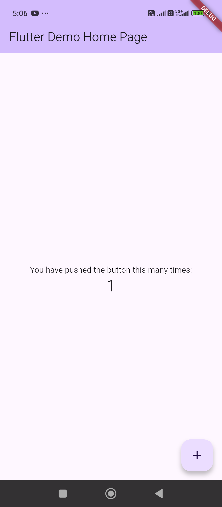

Let's set up **Flutter Integration Testing with Automation** step by step — so you can run full app tests automatically (locally or in CI/CD).

---

## 🧩 1. What Is Integration Testing in Flutter?

* **Unit tests** → test small functions.
* **Widget tests** → test a single widget in isolation.
* **Integration tests** → test the entire app on a real device or emulator (similar to end-to-end automation).

Integration testing automates user actions like:

* launching the app,
* tapping buttons,
* entering text,
* verifying results on screen.

---

## ⚙️ 2. Add Dependencies

Edit your **`pubspec.yaml`**:

```yaml
dev_dependencies:
  flutter_test:
    sdk: flutter
  integration_test:
    sdk: flutter
```

Then run:

```bash
flutter pub get
```

---

## 🧱 3. Folder Structure

Create a folder for integration tests:

```
project_root/
├── integration_test/
│   └── app_test.dart
└── test/
```

---

## 🧪 4. Example Test (`integration_test/app_test.dart`)

```dart
import 'package:flutter_test/flutter_test.dart';
import 'package:integration_test/integration_test.dart';
import 'package:my_app/main.dart' as app;

void main() {
  IntegrationTestWidgetsFlutterBinding.ensureInitialized();

  testWidgets('Counter increments smoke test', (WidgetTester tester) async {
    app.main(); // Launch the app
    await tester.pumpAndSettle();

    // Verify counter starts at 0
    expect(find.text('0'), findsOneWidget);

    // Tap the + icon and verify it increments
    await tester.tap(find.byIcon(Icons.add));
    await tester.pumpAndSettle();

    expect(find.text('1'), findsOneWidget);
  });
}
```

```dart
import 'package:flutter/material.dart';
import 'package:flutter_test/flutter_test.dart';
import 'package:integration_test/integration_test.dart';

import 'package:untitled1/main.dart' as app;


void main() {
  IntegrationTestWidgetsFlutterBinding.ensureInitialized();

  testWidgets('Counter increments smoke test', (WidgetTester tester) async {
    app.main(); // Launch the app
    await tester.pumpAndSettle();

    final Finder button = find.byIcon(Icons.add);

    // do
    for(var i = 0; i < 10; i++)
    {
        await tester.tap(button);
        await Future.delayed(const Duration(seconds: 1));
    }
    await tester.pumpAndSettle();
    
    // test
    expect(find.text('10'), findsOneWidget);
  });
}
```

---

## 🏃 5. Run Integration Test

### Android Emulator or Physical Device:

```bash
flutter test integration_test/app_test.dart
```

or (to run via `flutter_driver` interface):

```bash
flutter test integration_test
```

### Run on Chrome (for Flutter Web):

```bash
flutter drive \
  --driver=test_driver/integration_test.dart \
  --target=integration_test/app_test.dart \
  -d chrome
```

---

## 🧰 6. Optional: Create `test_driver/integration_test.dart`

For CI/CD or advanced automation, create a **driver entrypoint** file:

```dart
import 'package:integration_test/integration_test_driver.dart';

Future<void> main() => integrationDriver();
```

---

## 🤖 7. Automation Setup (CI/CD Example)

### GitHub Actions Example: `.github/workflows/flutter_integration_test.yml`

```yaml
name: Flutter Integration Test

on:
  push:
    branches: [ main ]
  pull_request:

jobs:
  integration_test:
    runs-on: ubuntu-latest

    steps:
      - uses: actions/checkout@v4
      - uses: subosito/flutter-action@v2
        with:
          flutter-version: '3.24.0'

      - run: flutter pub get
      - run: flutter test integration_test
```

> ✅ You can extend this workflow to run on emulators using `reactivecircus/android-emulator-runner` for Android, or `macos-latest` for iOS.

---

## 🔍 8. Generating Reports

To produce a machine-readable test report:

```bash
flutter test integration_test/app_test.dart --machine > result.json
```

or use:

```bash
flutter test --coverage
```

to generate coverage data.

---

## 💡 9. Best Practices

* Use `await tester.pumpAndSettle()` to wait for animations/UI updates.
* Use meaningful `find` selectors (`find.byType`, `find.byKey`, `find.text`).
* Add `Key()` identifiers in widgets you’ll interact with:

  ```dart
  TextField(key: Key('emailField'))
  ```
* Mock APIs or use test servers for predictable results.

---

## ✅ 10. Example with Login Screen

```dart
testWidgets('Login flow test', (WidgetTester tester) async {
  app.main();
  await tester.pumpAndSettle();

  await tester.enterText(find.byKey(Key('emailField')), 'test@example.com');
  await tester.enterText(find.byKey(Key('passwordField')), '123456');
  await tester.tap(find.byKey(Key('loginButton')));
  await tester.pumpAndSettle();

  expect(find.text('Welcome'), findsOneWidget);
});
```

---

Would you like me to include **Firebase emulator setup** or **GitHub Actions Android emulator automation** for this test next?



